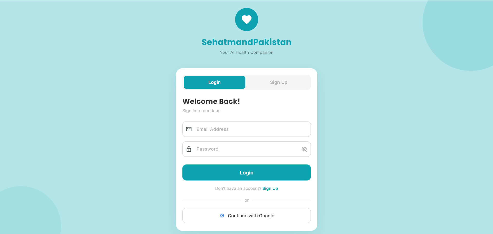
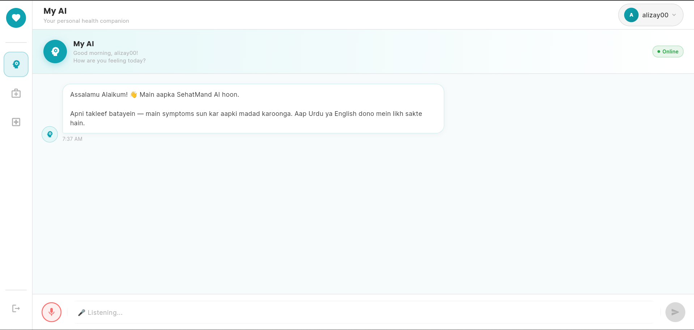
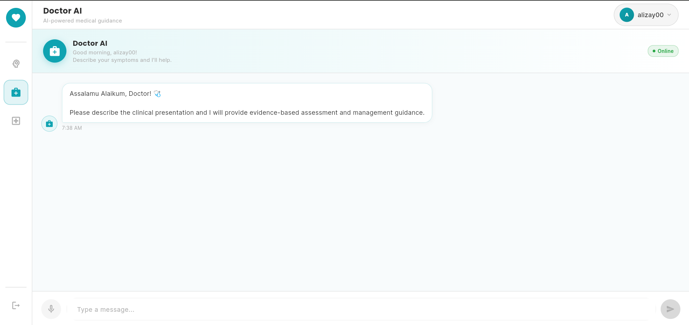
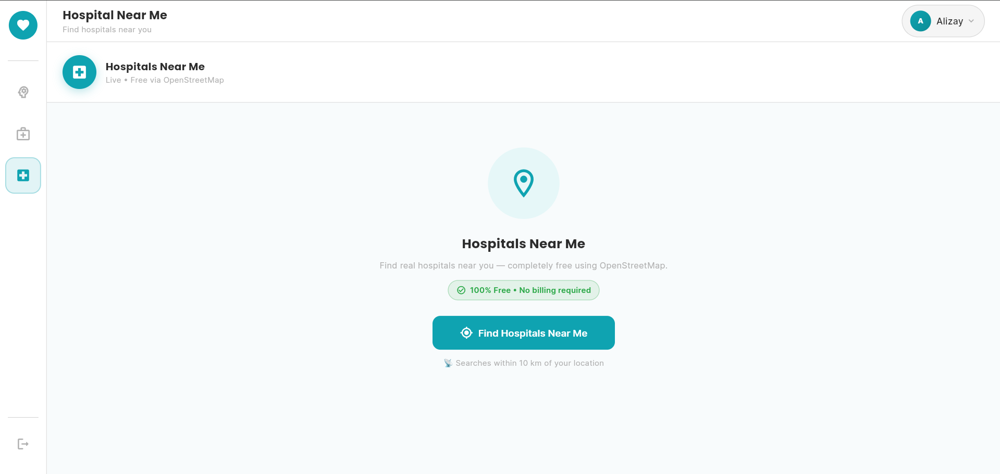

<p align="center">
  
  
  
  
  
</p>

<h1 align="center">🏥 SehatMand Pakistan</h1>

<p align="center">
  <strong>Your AI-Powered Health Companion — Built for Pakistan</strong><br/>
  Bilingual (English + Roman Urdu) tele-health platform with AI chat, doctor recommendations, and nearby hospital search.
</p>

<p align="center">
  
  
  
  
</p>

---

## 📱 App Screenshots

<p align="center">
  
  
  
  
</p>

## 🎥 Demo

Watch the project demo here:

▶️ https://drive.google.com/file/d/1F4KuesBC2ei-km3AniptZ6hCN3U9AWfu/view?usp=sharing

---

## 📖 Overview

**SehatMand Pakistan** is a full-stack AI health assistant that helps users in Pakistan (focused on Karachi) get immediate health guidance, specialist doctor recommendations, and nearby hospital locations — all through a modern Flutter app backed by a Python/Flask AI server.

The app understands both **English** and **Roman Urdu** (Urdu written in Latin script), making it accessible to a wide Pakistani audience. It features two AI modes — a gentle health advisor for general users and a clinical-grade doctor AI for more direct medical guidance.

### Key Highlights

- **Dual AI Modes** — "My AI" (friendly health advisor) and "Doctor AI" (clinical guidance)
- **Bilingual** — Responds in English or Roman Urdu, matching the user's language
- **2,834 Karachi Doctors** — Real dataset with names, hospitals, phone numbers, PMDC registration
- **Emergency Detection** — Automatically detects life-threatening keywords and displays emergency contacts
- **Nearby Hospitals** — GPS-based hospital finder with free OpenStreetMap data + Google Maps display
- **Voice Input** — Speech-to-text support for hands-free interaction
- **Safety Filters** — Prevents AI from diagnosing diseases, prescribing medicines, or suggesting brands

---

## 🏗️ Architecture

```
┌─────────────────────────────────────────────────────────────────┐
│                        FLUTTER FRONTEND                         │
│  ┌──────────┬─────────────────────────────────────────────────┐ │
│  │ SidePanel│  TopNavbar                                      │ │
│  │ (72px)   ├─────────────────────────────────────────────────┤ │
│  │          │                                                 │ │
│  │  My AI   │   ChatScreen  /  HospitalScreen                 │ │
│  │ Doctor AI│   (Riverpod state management)                   │ │
│  │ Hospital │                                                 │ │
│  │          │                                                 │ │
│  │  Logout  │                                                 │ │
│  └──────────┴─────────────────────────────────────────────────┘ │
│         │                    │                    │              │
│    Firebase Auth      POST /api/chat     GET /api/places/nearby │
└─────────┼────────────────────┼────────────────────┼─────────────┘
          │                    │                    │
          ▼                    ▼                    ▼
   ┌──────────┐     ┌──────────────────┐    ┌──────────────┐
   │ Firebase │     │   FLASK BACKEND  │    │ OpenStreetMap│
   │   Auth   │     │                  │    │ Overpass API │
   │          │     │  Intent Detector │    │ (Free Data)  │
   └──────────┘     │  Safety Filter   │    └──────┬───────┘
                    │  LLaMA 3 / Groq  │           │
          ┌─────────│  Firestore REST   │           ▼
          │         └──────────────────┘    ┌──────────────┐
          │                                 │ Google Maps  │
          │                                 │ Flutter API  │
          │                                 │ (Req. Key)   │
          │                                 └──────────────┘
          ▼
   ┌──────────────┐
   │   Firebase    │
   │  Firestore    │
   │ (2,834 docs)  │
   └──────────────┘
```

---

## ✨ Features

### 🤖 AI Chat — My AI (User Mode)
- Friendly, caring health assistant for general users
- Explains symptoms in simple terms with home care tips
- Detects when a specialist is needed and auto-fetches matching doctors from the database
- Structured responses: Understanding → Suggestions → Home Remedies → When to See a Doctor
- Never confirms diagnoses or prescribes specific medicines

### 🩺 AI Chat — Doctor AI (Clinical Mode)
- Speaks directly to the patient like a trusted family doctor
- Classifies severity (Mild → Moderate → Urgent) and responds accordingly
- Provides actionable clinical advice with follow-up recommendations
- Detects clinical specialties and references relevant Karachi-based doctors

### 🚨 Emergency Detection
- Scans every message for 50+ emergency keywords in English and Roman Urdu
- Cardiac emergencies, breathing crises, stroke symptoms, severe bleeding, poisoning, and more
- Instantly shows Pakistan emergency numbers: **1122** (Rescue), **115** (Edhi), **1020** (Aman Foundation)

### 🏥 Hospital Finder
- GPS-based nearby hospital search (within 10 km radius)
- Interactive Google Maps view with hospital markers
- Hospital cards ranked by distance with address, phone, and directions
- **Hybrid approach**: Free hospital data via OpenStreetMap Overpass API + Google Maps for display
- Requires Google Maps API key for map visualization
- One-tap Google Maps navigation to any hospital

### 🔐 Authentication
- Email/Password sign up and login with validation
- Google Sign-In (platform-aware: popup on web, native on mobile)
- Auth-guarded routing — unauthenticated users redirected to login
- Beautiful animated splash screen with brand intro

### 🎤 Voice Input
- Speech-to-text powered by `speech_to_text` package
- Animated listening indicator on the microphone button
- Supports continuous speech with interim results
- 30-second listen duration with auto-stop

---

## 🛠️ Tech Stack

| Layer | Technology | Purpose |
|-------|-----------|---------|
| **Frontend** | Flutter 3.x (Dart) | Cross-platform UI (Android, iOS, Web, Desktop) |
| **State Management** | Riverpod | Reactive state with `StateNotifier` and `StreamProvider` |
| **Routing** | GoRouter | Declarative auth-guarded navigation |
| **UI Framework** | Material 3 | Teal-themed custom design system |
| **Backend** | Python + Flask | REST API server |
| **AI Model** | LLaMA 3.1 8B (via Groq Cloud) | Primary AI inference |
| **AI Fallback** | LLaMA 3 (via Ollama, local) | Offline/fallback AI inference |
| **Database** | Firebase Firestore | 2,834 Karachi doctor records |
| **Auth** | Firebase Authentication | Email/password + Google Sign-In |
| **Maps** | Google Maps Flutter + Geolocator | Hospital map display and GPS |
| **Hospital Data** | OpenStreetMap Overpass API | Free hospital data source (backend) |
| **Deployment** | Gunicorn + Heroku-compatible | Production backend serving |

---

## 📂 Project Structure

```
SehatMand/
├── backend/                        # Python Flask API
│   ├── app.py                      # Main server — chat, hospital search, health endpoints
│   ├── requirements.txt            # Python dependencies
│   ├── Procfile                    # Gunicorn deployment config
│   ├── clean_doctor_dataset.py     # Dataset cleaning script (23,007 → 2,834 doctors)
│   ├── upload_to_firestore.py      # Firestore bulk upload script
│   ├── cleaned_doctors.csv         # Cleaned Karachi doctor dataset
│   ├── doctors_cache.json          # Local cache (avoids repeated Firestore hits)
│   └── modules/
│       ├── intent_detector.py      # Intent classification + specialization mapping
│       ├── llama_service.py        # LLaMA 3 integration (Groq + Ollama fallback)
│       ├── safety_filter.py        # Emergency detection + restricted content filter
│       └── firestore_service.py    # Firestore REST client with caching
│
├── frontend/                       # Flutter application
│   ├── pubspec.yaml                # Flutter dependencies
│   ├── lib/
│   │   ├── main.dart               # App entry point
│   │   ├── firebase_options.dart   # Firebase configuration
│   │   ├── core/
│   │   │   ├── constants/          # Colors, strings
│   │   │   ├── router/             # GoRouter with auth redirect
│   │   │   └── theme/              # Material 3 custom theme
│   │   ├── features/
│   │   │   ├── auth/               # Login, signup, splash, Google Sign-In
│   │   │   ├── home/               # Main layout with sidebar navigation
│   │   │   ├── hospital/           # GPS hospital search with Google Maps
│   │   │   └── my_ai/              # Chat provider (My AI + Doctor AI)
│   │   ├── services/
│   │   │   ├── api_service.dart    # HTTP client for Flask backend
│   │   │   └── auth_service.dart   # Firebase Auth wrapper
│   │   └── shared/
│   │       ├── models/             # User, Message, Doctor, ChatResponse models
│   │       └── widgets/            # SidePanel, TopNavbar, ChatScreen, ChatBubble, ChatInput
│   ├── android/                    # Android platform config
│   ├── ios/                        # iOS platform config
│   ├── web/                        # Web platform config
│   ├── macos/                      # macOS platform config
│   ├── linux/                      # Linux platform config
│   └── windows/                    # Windows platform config
│
└── README.md                       # ← You are here
```

---

## 🔄 Request Flow

### Chat Flow
```
User types message (or uses voice input)
    │
    ▼
Flutter App ──POST /api/chat──▶ Flask Backend
    │                              │
    │                    1. Emergency keyword check
    │                       └─ Match? → Return 🚨 emergency response
    │                    2. Detect intent & specialization
    │                    3. If specialist → query Firestore for doctors
    │                    4. Build prompt with conversation history
    │                    5. Call LLaMA 3 (Groq → Ollama fallback)
    │                    6. Filter response for restricted content
    │                              │
    │◀──── JSON Response ──────────┘
    │   { reply, type, specialist, doctors[] }
    ▼
Display: text bubble / emergency card / doctor recommendation cards
```

### Hospital Search Flow
```
User taps "Find Hospitals Near Me"
    │
    ▼
Request GPS permission → Get coordinates
    │
    ▼
Flutter App ──GET /api/places/nearby?lat=...&lng=...──▶ Flask Backend
    │                                                        │
    │                                          Query OpenStreetMap Overpass API
    │                                          (tries 3 mirrors for reliability)
    │                                          Parse, deduplicate, sort by distance
    │                                                        │
    │◀─────────── { results: [...hospitals] } ───────────────┘
    ▼
Google Maps display (requires API key) with markers + ranked hospital cards
```

---

## 🔌 API Endpoints

| Method | Endpoint | Description |
|--------|----------|-------------|
| `POST` | `/api/chat` | Send message to AI (user or doctor mode) |
| `GET` | `/api/places/nearby` | Search nearby hospitals by GPS coordinates |
| `POST` | `/api/clear` | Clear server-side conversation session |
| `GET` | `/api/health` | Backend health check & status |

### `POST /api/chat` — Request
```json
{
  "message": "mujhe sar mein bohat dard ho raha hai",
  "mode": "user",
  "session_id": "abc123xyz"
}
```

### `POST /api/chat` — Response
```json
{
  "reply": "I understand you're experiencing severe headaches...",
  "type": "specialist",
  "specialist": "neurologist",
  "doctors": [
    {
      "name": "dr ahmed raza",
      "hospital_name": "akbar hospital karachi",
      "specialization": "neurologist",
      "phone": "923012345678",
      "pmdc": "12345-P",
      "city": "karachi"
    }
  ],
  "mode": "user"
}
```

### `GET /api/places/nearby?lat=24.86&lng=67.01&radius=10000` — Response
```json
{
  "status": "OK",
  "results": [
    {
      "place_id": "123456",
      "name": "Aga Khan University Hospital",
      "vicinity": "Stadium Road, Karachi",
      "phone": "+92-21-111-911-911",
      "distance_km": 1.24,
      "geometry": { "location": { "lat": 24.8918, "lng": 67.0745 } }
    }
  ]
}
```

---

## 🧠 Supported Medical Specializations

The intent detector recognizes **14+ specializations** in both English and Roman Urdu:

| Specialist | Example Triggers |
|-----------|-----------------|
| Cardiologist | "heart problem", "dil ka dora", "chest pain", "bp" |
| Gynecologist | "pregnancy", "hamal", "periods", "ladies doctor" |
| Pediatrician | "bachon ka doctor", "child specialist", "newborn" |
| Neurologist | "migraine", "dimagh", "sir dard", "seizure" |
| Dermatologist | "skin problem", "kharish", "acne", "daag" |
| Orthopedic | "haddi", "joint pain", "kamar dard", "fracture" |
| Diabetologist | "sugar", "diabetes", "insulin", "blood sugar" |
| Gastroenterologist | "pait dard", "ulcer", "acidity", "liver" |
| ENT Specialist | "kaan", "naak", "gala", "tonsil" |
| Psychiatrist | "mental health", "depression", "anxiety", "neend nahi" |
| Urologist | "kidney", "peshab", "gurda", "bladder" |
| And more... | Pulmonologist, Ophthalmologist, General Surgeon, Dentist |

---

## 🛡️ Safety & Ethics

| Rule | Implementation |
|------|---------------|
| **No Diagnosis** | AI never confirms disease names — describes possibilities instead |
| **No Prescriptions** | Blocks specific medicine brands, exact dosages, tablet counts |
| **Emergency First** | 50+ emergency keywords trigger immediate hospital/ambulance guidance |
| **Restricted Output Filter** | Post-processes every AI response to catch unsafe content |
| **Emotional Support** | Detects distress keywords and responds with empathy and helpline info |
| **Always Refer** | Every response encourages consulting a real doctor |
| **Data Privacy** | `serviceAccountKey.json` and sensitive files are gitignored |

---

## 🚀 Getting Started

### Prerequisites

- **Python 3.10+**
- **Flutter 3.x** (with Dart SDK ≥3.0.0)
- **Firebase Project** with Authentication and Firestore enabled
- **Groq API Key** ([get one free](https://console.groq.com)) — or Ollama installed locally
- **Google Maps API Key** (for the hospital map view in Flutter)

### 1. Clone the Repository

```bash
git clone https://github.com/Anmol-png/SehatMandPakistan
cd SehatMand-Pakistan
```

### 2. Backend Setup

```bash
cd backend

# Create virtual environment
python -m venv venv
source venv/bin/activate        # Linux/Mac
venv\Scripts\activate           # Windows

# Install dependencies
pip install -r requirements.txt

# Add environment variables
# Create a .env file in the backend/ folder:
echo "GROQ_API_KEY=your_groq_api_key_here" > .env

# Add Firebase credentials
# Place your serviceAccountKey.json in the backend/ folder

# Run the server
python app.py
```

The backend will start at `http://localhost:5000`.

### 3. Frontend Setup

```bash
cd frontend

# Get Flutter packages
flutter pub get

# Run on your preferred platform
flutter run -d chrome        # Web
flutter run -d windows       # Windows
flutter run                  # Connected Android/iOS device
```

> **Note:** Update the `baseUrl` in `lib/services/api_service.dart` to match your backend URL. For Android emulator, use `http://10.0.2.2:5000`.

### 4. Firebase Configuration

1. Create a Firebase project at [console.firebase.google.com](https://console.firebase.google.com)
2. Enable **Authentication** (Email/Password + Google Sign-In)
3. Enable **Cloud Firestore**
4. Run `flutterfire configure` to generate `firebase_options.dart`
5. Place `google-services.json` in `frontend/android/app/`
6. Download your service account key and place it as `backend/serviceAccountKey.json`

### 5. Populate Doctor Database (Optional)

```bash
cd backend

# Clean the raw dataset
python clean_doctor_dataset.py

# Upload to Firestore
python upload_to_firestore.py
```

---

## 🌐 Deployment

### Backend (Heroku / Railway / Render)

The backend includes a `Procfile` for easy deployment:

```
web: gunicorn app:app
```

Set the `GROQ_API_KEY` environment variable in your hosting platform's dashboard.

### Frontend (Web)

```bash
cd frontend
flutter build web
```

The built files will be in `frontend/build/web/` — deploy to Firebase Hosting, Vercel, Netlify, or any static host.

---

## 📊 Dataset

| Metric | Value |
|--------|-------|
| **Raw Records** | 23,007 doctors across Pakistan |
| **Cleaned & Filtered** | 2,834 Karachi-based doctors |
| **Fields** | Name, Hospital, Specialization, City, Phone, PMDC, Active Status |
| **Source** | Pakistan Medical & Dental Council (PMDC) registry |
| **Storage** | Firebase Firestore + Local JSON cache for fast reads |

---

## 🎨 Design System

| Element | Value |
|---------|-------|
| **Primary Color** | `#0FA3B1` (Teal) |
| **Accent Color** | `#FF6B6B` (Coral) |
| **Heading Font** | Poppins (Bold) |
| **Body Font** | Inter |
| **Design System** | Material 3 |
| **Border Radius** | 10–12px throughout |
| **Sidebar Width** | 72px (icon-only) |

---

## 🤝 Contributing

1. Fork the repository
2. Create a feature branch (`git checkout -b feature/amazing-feature`)
3. Commit your changes (`git commit -m 'Add amazing feature'`)
4. Push to the branch (`git push origin feature/amazing-feature`)
5. Open a Pull Request
---

## 👥 Contributors

- **Alizay Ahmed** — alizay1206@gmail.com
- **Anmol Kumari** — anmolkumari.0248@gmail.com
- **Muhammad Alam** — muhammad712005@gmail.com
- **Muhammad Hassan** — hassanirfan828@gmail.com

---

## 🙏 Acknowledgments

- **[Groq](https://groq.com)** — Ultra-fast LLaMA 3 inference API
- **[Meta AI](https://ai.meta.com)** — LLaMA 3 open-source language model
- **[OpenStreetMap](https://www.openstreetmap.org)** — Free hospital location data via Overpass API
- **[Firebase](https://firebase.google.com)** — Authentication and Firestore database
- **[Flutter](https://flutter.dev)** — Beautiful cross-platform UI framework

---

<p align="center">
  Made with ❤️ for Pakistan
</p>
